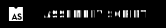

    

<h1 align="center">
   Hi there, I'm Michael👋
</h1>

    
    
    
    
    
    
    

## 🧑‍💻 About Me

Originally from New Zealand, living in Vienna.
Currently studying @42Vienna

## 📚 Skills

    
    
    
    

## 🌱 Currently working on...

Minishell - basic shell built in C.

## 💻 Want to learn

    
    
    
    
    
    

## 🔗 Links

<!--
**Schmitzi/schmitzi** is a ✨ _special_ ✨ repository because its `README.md` (this file) appears on your GitHub profile.

Here are some ideas to get you started:

- 🔭 I’m currently working on ...
- 🌱 I’m currently learning ...
- 👯 I’m looking to collaborate on ...
- 🤔 I’m looking for help with ...
- 💬 Ask me about ...
- 📫 How to reach me: ...
- 😄 Pronouns: ...
- ⚡ Fun fact: ...
-->
