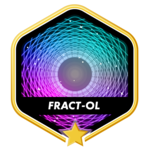
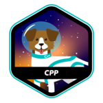

    

<h1 align="center">
   Hello World, I'm Michael👋
</h1>

## 🧑‍💻 About Me

Originally from New Zealand, living in Vienna.
Master Student @42Vienna

## 📚 Skills

    
    
    
    
    
    
    
    
    
    
    
    

## 🌱 Currently working on...

libasm - base C functions rebuilt in Intel x86 assembly

ft_linux - Building a linux distro on the Linux Kernel

kfs - Building a *Kernel From Scratch* in Rust

## 42 Vienna Trophy Case

    
    
    
    
    
    
    
    
    
    
    
    
    
    

## 🔗 Links

    
    

